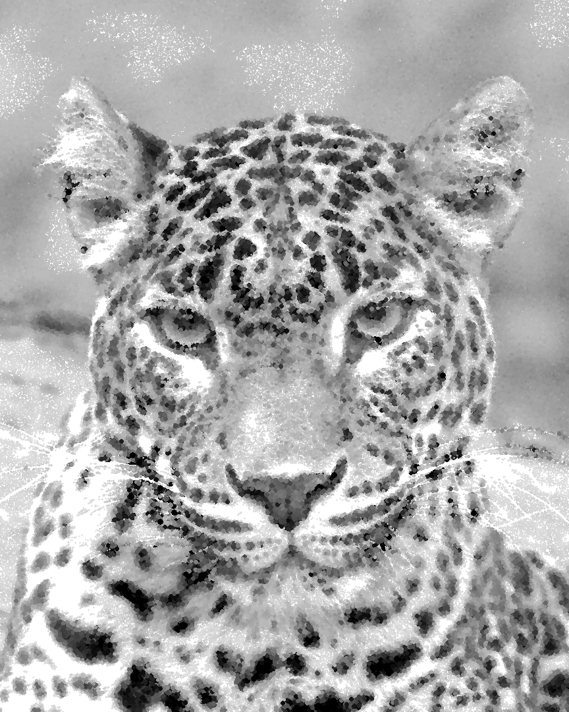
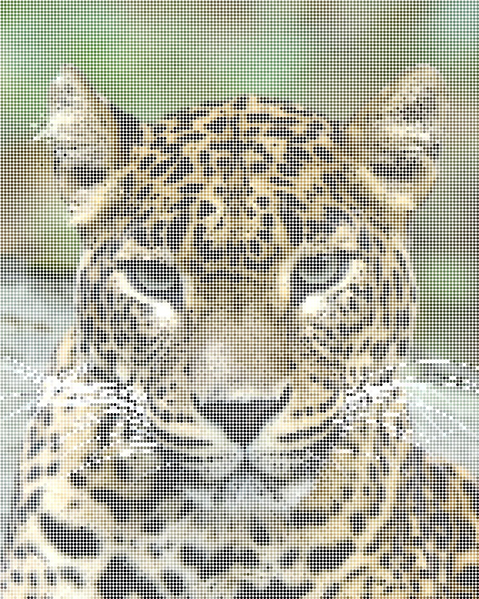
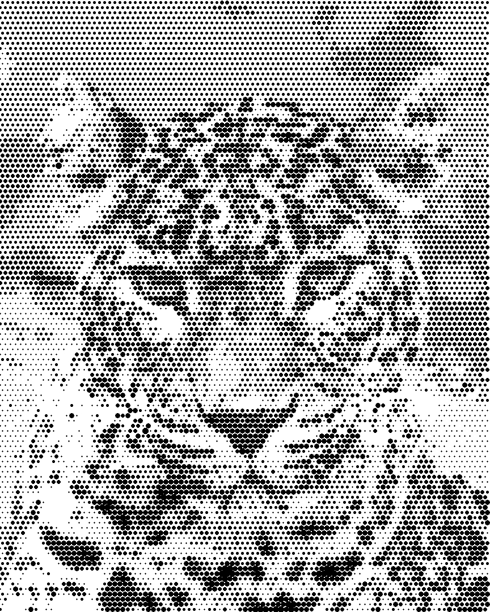

# gimp-dots
A simple filter for GIMP 2.10 that renders a dotted version of a given image.

## 👨‍🔧 How to install?
Extract the dots.zip into your GIMP plug-ins folder. (for example: *C:\Program Files\GIMP 2\lib\gimp\2.0\plug-ins*). The plug-in should be visible when you open GIMP. Go to:

*Filters > Artistic > Dots...*

## 🔑 How does it work?
This plugin simply renders a dotted version of the image. There are some options to control the way it works:

1. Render from *visible / current layer*
    - This allows you to choose between rendering from what is currently visible and currently selected layer. Good if you are working on a file with multiple layers on top but want to apply this on layer below.
2. Dot density
    - Determines how densely dots are drawn. Values taken from range of *1 to 10 000*.
3. Max dot size
    - Determines the maximum size of a dot. If dot scaling is not enabled, each dot is using the max size. This value is practically the **radius** of the dot, not diameter. Values taken from range of *1 to 1000*.
4. Dot distribution *random/uniform/pattern*
    - Defines how dots are distributed on the render area. Random means that dots are placed anywhere within the range of the image. Unifrom means that the dots will form an uniform grid pattern. Pattern means that every second row is moved half a step to the left (see the sample pictures).
5. Scale *Yes/No*
    - Whether to scale the dots based on the brightness of the pixel the dot's center is at. Brighter areas are smaller and darker areas bigger, unless invert scale is set to ``True``, in which case the opposite is true. If set to ``False``, all dots are of the same size.
6. Invert scale *Yes/No*
    - Whether to invert the scaling. If set to ``True``, brighter areas are rendered with larger dots and darker areas with smaller dots.
7. Fade *Yes/No*
    - Whether to fade the dot based on the brightness value. If set to ``True``, brighter areas are more transparent and only fully dark areas are fully opaque.
8. Invert fade *Yes/No*
    - Whether to invert fade, meaning that darker areas are more transparent and only white areas are fully opaque.
9. Dot coloring *Custom/From image*
    - Define the color of the dot. Custom means that all dots have the same base color, that can be defined with the custom color selector. From image means that the color of the pixel where the dot's center is at is going to be the color of the dot.
10. Custom dot color
    - Define the custom color for dots. Has effect only if dot coloring is set to custom. Default value is black.

## 🪓 How to edit?
The source code for the plug-in is available in this Github repo. Feel free to modify it to your needs. Here are few tips that you should be aware of:

1. The venv does not recognize gimpfu and I did not spend time trying to make it work. You can pretty easily test the script straight in the GIMP, but the script needs to be placed in the plug-ins folder.
2. dots.py must be compiled into an executable and then the executable must be placed in plug-ins/dots -folder. You can use for example [Pyinstaller](https://pyinstaller.org/en/stable/) to compile the script. Run the following command:
``pyinstaller --onefile -w dots.py`` The executable will be in *dist* folder once it has been succesfully compiled.

## 📷 Sample images
Base image

Random dots, density 400, max scale 4

Uniform dots, density 200, max scale 2

Pattern dots, density 100, max scale 5

## 🧱 Did you encounter a bug? Want to give feedback?
Please contact me!